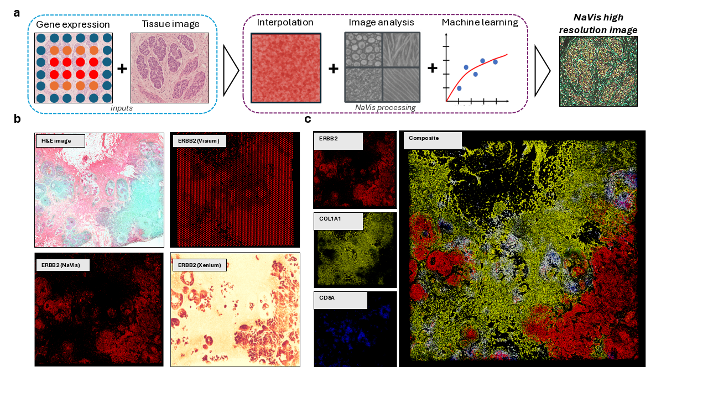
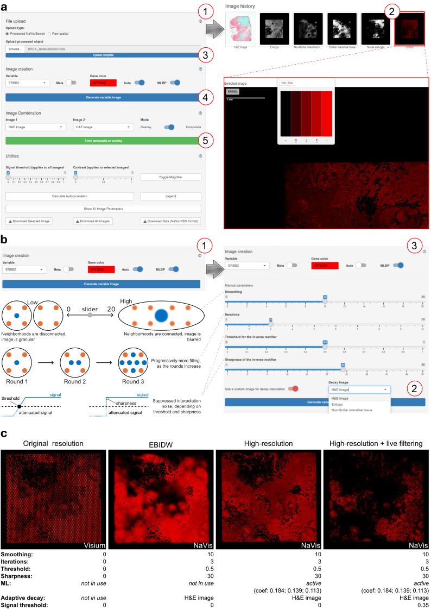

# NaVis: a virtual microscopy framework for interactive, high-resolution navigation of spatial transcriptomics data

[Ayomide Oshinjo](https://orcid.org/0000-0003-4303-0181) 1, [Jiahui Wu](https://orcid.org/0000-0002-8525-1794) 1, [Petar B. Petrov](https://orcid.org/0000-0001-5551-8032) 1, [Valerio Izzi](https://orcid.org/0000-0002-9960-4917) 1

1. Faculty of Biochemistry and Molecular Medicine, University of Oulu, Oulu, FI-90014, Finland

---
* NaVis transforms spatial transcriptomics analysis into an interactive microscopy experience, through an intuitive graphical user interface implemented in R Shiny.
* NaVis is **freely** available online at https://matrinet.shinyapps.io/NaVis/
* A list of **pre-processed, ready-to-use datasets are available** [here](https://figshare.com/s/3e568dcb32106767cd5e).

[](https://matrinet.shinyapps.io/NaVis/)
[](https://figshare.com/s/3e568dcb32106767cd5e)
[](https://github.com/Izzilab/NaVis)
[](https://www.biorxiv.org/content/10.64898/2026.02.18.706509v1)

* Authors and maintainers: Izzi Lab (✉️ <valerio.izzi@oulu.fi>)
* This work was supported by the following grants:

[](https://www.cares-eu.org/)
[](https://syopasaatio.fi/)
[]([https://www.genecellnano.fi/])
[]([https://ican.fi/icandoc/])


## Motivation
Spatial transcriptomics (ST) methods face a trade-off between spatial resolution and transcriptome coverage, and users interested in ST need to resort to computational expertise and static analyses, limiting accessibility and interpretability of ST methods. **NaVis** is a web-based, interactive platform that transforms ST analysis into a microscopy experience. NaVis applies to low-res, whole-trascriptome ST technologies from 10x Genomics (Visium V1/V2, Cytassist and VisiumHD) and delivers near–real-time, super-resolution reconstructions of gene expression that rival with the level of detail of fluorescence microscopy. Its intuitive point-and-click interface lets researchers, clinicians, and pathologists explore, visualize, and quantify spatial gene expression without any coding, democratizing access to high-resolution spatial omics. 

At its core, NaVis embeds an expression-based inverse distance weighting (EBIDW) engine augmented by a two-stage adaptive machine-learning (ML) decay module. This framework enables interpolation over millions of virtual spatial locations while preserving fine-grained spatial gradients to the level of the underlying tissue image, largely overcoming the limited resolution of commonly used ST analysis tools **(Figure 1)**. 


> **Figure 1. NaVis transforms spatial transcriptomics into a high-resolution, microscopy-like experience.** a) Overview of the NaVis algorithm. Starting from low-resolution Visium gene expression data and a corresponding guide image (typically the accompanying H&E), NaVis performs rapid interpolation and tissue image analysis, integrating both through a machine-learning model to produce a high-resolution reconstruction of the original coarse expression map. The resulting image is biologically grounded through nuclei, stromal, and textural features extracted from the histology. b) Representative ERBB2 visualizations showing the original Visium resolution, the NaVis high-resolution reconstruction informed by the H&E image, and matched Xenium data from the same tissue section. c) Example of a high-resolution composite generated by combining ERBB2, COL1A1, and CD8A single-gene views, illustrating the level of structural and molecular detail attainable with NaVis.

NaVis enables users to navigate whole-tissue data with the fluidity of a digital microscope while obtaining super-resolution transcriptomic reconstructions within seconds, approaching the spatial detail of Xenium yet retaining the full breadth of transcriptome-wide measurements. Users can generate gene and metadata images, explore them at different resolutions, zoom them under a 5X magnifying lens, form overlays and composites, and adjust rendering parameters with the immediacy typical of microscopy rather than bioinformatic analysis tools. All core parameters, including those governing the EBIDW algorithm and the ML module, as well as supplementary controls such as noise filtering and image enhancement, are fully configurable and update the user’s current field of view in real time or near real-time (**Figure 2**).


>**Figure 2. NaVis interface and parameters.** a) Interface. NaVis is designed for immediacy, accessibility, and point-and-click usability. (1) Users can upload preprocessed or raw data and, when necessary, launch automated image analysis. (2) Each generated image appears in the thumbnail panel; selecting a thumbnail opens the image at full resolution in the main viewer. (3) Gene-level images can then be generated at multiple resolutions depending on user-defined parameters and will appear in the thumbnail gallery. (4) Multiple images can be combined or overlaid for comparative visualization. (5) A set of interactive tools - including zooming, adjustments, color-scale and extensive metadata display, and full-resolution image or data download - is available in the bottom control bar. b) Parametric controllers. NaVis ships with pre-validated default settings that perform consistently across diverse datasets. (1) Disabling the Auto option reveals manual controls for the interpolation stage, including: smoothing (interpolation strength / neighborhood size), iterations (number of sequential passes), threshold (high-pass filter to reduce smoothing noise), and sharpness (degree of suppression applied below the threshold). A pictorial representation of parameters’ effect on the interpolation process is shown beside. (2) A separate panel allows users to select the reference image used to derive the adaptive decay mask, and (3) a dedicated button enables/disables the machine-learning boost-and-prune (MLBP) step. c) Image interpolation parameters. NaVis enhances resolution through a sequence of adaptive steps. With smoothing = 0, the image matches the native Visium grid. Applying EBIDW with the H&E-based decay mask produces an immediate gain in resolution and edge definition. Passing this result through the ML boost/prune module (a ridge-regression–like decomposition into biological features) further sharpens structure. ML coefficients reflect contributions from nuclei/cells, fibrillar stroma, and non-fibrillar tissue, respectively. A final user-defined threshold (35% in this example) yields the most accurate and noise-reduced output. Original data from Janesick et al. (2023, https://doi.org/10.1038/s41467-023-43458-x). 
  

## Data formats
If you are not ready to upload your own data, have a look at our pre-processed dataset gallery [here](https://figshare.com/s/3e568dcb32106767cd5e).
NaVis can operate from both **raw 10x Genomics outputs** (from the SpaceRanger pipeline) and **preprocessed datasets**. The latter include Spatial Seurat objects (only the latest V5 objects are supported) and navis objects, as they can downloaded from the NaVis app. In both cases, they should be saved as .RDS.
Raw data are the preferred input, as they include the high-resolution images needed to make the most out of NaVis. Conversely, Seurat objects typically include only low-resolution images. While NaVis can significantly increase the quality of gene expression representations even in these cases, the results won't be as "sharp" as with raw data. In case users have important information in their Seurat metadata which they wish to use later in NaVis, we suggest to export them as .txt in the **spatial** folder of the raw data (see the next paragraph) so they will be automatically imported.

Any type of raw Visium data (Visium ST V1, V2, Cytassist and VisiumHD) can be imported into NaVis. **Currently, the best results with default settings are obtained with V1 and V2 data**. Users importing cytassist and/or VisiumHD are advised to experiment with the super-resolution settings until the desired level of detail/clarity is achieved.

**Raw Visium data are always imported as a single ZIP file**, e.g. `zipped_folder.ZIP`. Upon upload, NaVis will ask to validate the input and prevent processing if the folder structure is not as expected. To avoid inconveniences, the following data structures should be followed. Notice that **all the elements inside the zipped folder must be named exactly in the guide below**. Any difference will result in invalid input! The name of the zip folder itself, does not matter.

### *Visium V1/V2 (minimal data needed):*
```
📦 zipped_folder.ZIP
│
🗁 zipped_folder/
├── filtered_feature_bc_matrix.h5
└── 🗁 spatial/
    ├── scalefactors_json.json
    ├── tissue_hires_image.png
    ├── tissue_lowres_image.png
    └── tissue_positions_list.csv ("tissue_positions.csv" is also accepted)
```

In case your data follow the older format, where the data matrix is a folder with three files itself, the expected structure is the following:

```
📦 zipped_folder.ZIP
│
🗁 zipped_folder/
├── 🗁 filtered_feature_bc_matrix/
│   ├── barcodes.tsv.gz
│   ├── features.tsv.gz
│   └── matrix.mtx.gz
└── 🗁 spatial/
    ├── scalefactors_json.json
    ├── tissue_hires_image.png
    ├── tissue_lowres_image.png
    └── tissue_positions_list.csv ("tissue_positions".csv is also accepted)
```

### *Visium Cytassist (minimal data needed):*
```
📦 zipped_folder.ZIP
│
🗁 zipped_folder/
├── filtered_feature_bc_matrix.h5
└── 🗁 spatial/
    ├── cytassist_image.tiff
    ├── scalefactors_json.json
    └── tissue_positions.csv
```

### *Visium HD (minimal data needed):*
```
📦 zipped_folder.ZIP
│
🗁 zipped_folder/
├── filtered_feature_bc_matrix.h5
└── 🗁 spatial/
    ├── scalefactors_json.json
    ├── tissue_hires_image.png
    ├── tissue_lowres_image.png
    └── tissue_positions.parquet

```


