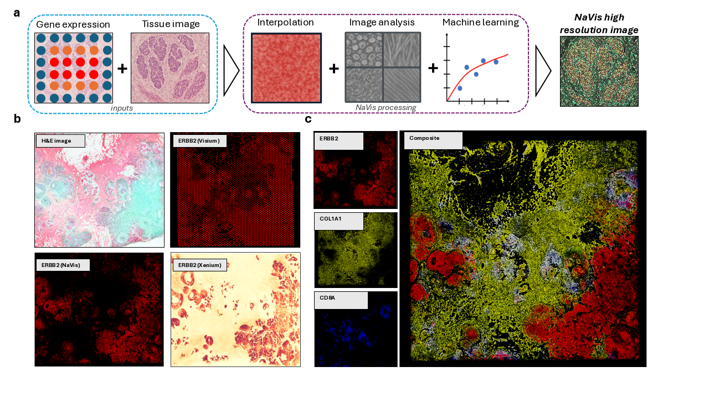

# NaVis

**NaVis: a virtual microscopy framework for interactive histological interrogation of spatial transcriptomics data.**

[Ayomide Oshinjo](https://orcid.org/0000-0003-4303-0181) 1, [Jiahui Wu](https://orcid.org/0000-0002-8525-1794) 1, [Petar B. Petrov](https://orcid.org/0000-0001-5551-8032) 1, [Ali Hashmi](https://orcid.org/0000-0001-9946-7679) 2, [Johanna I Englund](https://orcid.org/0000-0001-9637-6843)2 [Valerio Izzi](https://orcid.org/0000-0002-9960-4917) 1

1. Faculty of Biochemistry and Molecular Medicine, University of Oulu, Oulu, FI-90014, Finland
2. Institute of Biotechnology, HiLIFE, University of Helsinki, Finland

---

🔗 **Live app**: https://izzilab-navis.share.connect.posit.cloud
📄 **Preprint**: [bioRxiv 2026.02.18.706509v2](https://www.biorxiv.org/content/10.64898/2026.02.18.706509v2)
🛠 **Source**: this repository · MIT license

---

* A list of **pre-processed, ready-to-use datasets are available** [here](https://figshare.com/s/3e568dcb32106767cd5e).

* Authors and maintainers: Izzi Lab (✉️ <valerio.izzi@oulu.fi>)

[](https://matrinet.shinyapps.io/NaVis/)
[](https://figshare.com/s/3e568dcb32106767cd5e)
[](https://github.com/Izzilab/NaVis)
[](https://www.biorxiv.org/content/10.64898/2026.02.18.706509v1)
[](https://www.cares-eu.org/)
[](https://www.sigridjuselius.fi/en/)
[](https://www.genecellnano.fi/)
[](https://ican.fi/icandoc/)

---


## TL;DR

NaVis turns a spatial transcriptomics (ST) — such as 10x Genomics Visium experiment or other methods shipping gene expression counts plus an H&E image of the same tissue — into a microscopy-style interactive workflow that runs in your browser, requires no coding, and treats the histology as a quantitative measurement deeply interconnected with the transcriptomics layer.

Most importantly, NaVis is built around the idea to make ST accessible to anyone familiar with microscopy rather than bioinformatics. Thus, you **acquire** genes the way a microscopist acquires fluorescence channels, **composite** them in any color, **overlay** them on the H&E with live opacity control, and **interrogate** the tissue at three levels of granularity: a single point (left-click), two regions in side-by-side comparison (right-click twice), or a drawn region of interest (shift+drag) that surfaces the top genes enriched within it. The H&E image is automatically decomposed into three quantitative tissue-architecture compartments (nuclei-rich, fibrillar ECM, soft tissue) that are fully-accessible image objects alongside the gene channels, so every gene, signature, or compartment can be intersected, correlated, or compared against any other.

A single **Insights** panel quantifies each channel against the histological compartments along five axes — compartment enrichment, expression-boundary alignment, spatial cross-correlation at lag distances, expression-island morphology with automatic pattern interpretation, and a histology-decoupling score. A **Find Similar Genes** search returns the top transcriptome-wide matches to any query channel in under five seconds, by direct all-spot Pearson correlation.

NaVis supports natively 10x Visium V1/V2, CytAssist, and Visium HD (8 µm and 16 µm bin levels). It accepts Seurat objects, SpatialExperiment objects, raw Space Ranger output folders, and internally converts them into our own NaVis format. So, technically, any ST method that features an H&E image and can be packaged as a Seurat or SpatialExperiment should also work, though we are still actively testing integrations and deploying converters. If you don't have data, no worries! NaVis comes with a bundled demo!

All outputs (interpolated gene maps, composites, Insights tables, similarity rankings) can be downloaded as PNG, CSV, or ZIP.

> 

---

## Detailed description

### The problem NaVis addresses

Sequencing-based ST methods, such as those of the 10x Genomics "Visium" family, produce two co-registered, spatially-resolved measurements of the same tissue: a gene expression matrix and a high-resolution H&E image that share a coordinate system. These are not alternative views — they are complementary readouts of the same biology, and most biological questions concern their _intersection_. Where is this gene expressed relative to tissue architecture? Do its boundaries follow the biological structures underneath? Do two genes co-decorate the same compartment, and where exactly do they part ways?

Existing tools treat the two measurements asymmetrically. Seurat, Giotto, STUtility and spatial-domain callers like SpatialDE or BayesSpace use the spot-by-gene matrix as the quantitative substrate and leave the H&E as a background layer. 10x's Loupe Browser is a point-and-click viewer that displays spots on tissue but neither quantifies the relationship between expression and histology nor combines genes into composite channels. To answer questions that span transcriptomics and histology, a user has to leave the viewer and write code that stitches together image segmentation, registration, and correlation — with several parameter choices for which no standard practices might be in place.

NaVis is built around this gap. The H&E becomes a quantitative readout placed on equal footing with the expression data; each gene becomes an image registered to the same grid; every operation in the tool is a manipulation of images that share the same coordinate system. The design target is the experimental biologist, the pathologist, the clinician, or the trainee with a specific tissue question and currently no path to answer it without delegating the analysis.

### What you can do with it

**Load any Visium object you already have.** NaVis accepts Seurat (v4 or v5) and SpatialExperiment objects saved as `.rds`, raw Space Ranger output folders zipped from disk (including CytAssist and HD layouts), or a bundled demo dataset (10x FFPE DCIS breast cancer). When the loaded object is unnormalized, NaVis applies log-CPM normalization on the fly without mutating the input. If the object has never been analyzed before by NaVis, image decomposition will take place. Otherwise, loading a pre-processed object will skip the image analysis step.

**Acquire genes as images.** The Acquire panel takes one or more gene names, a color, and a click — and it reconstructs the gene's spatial expression as a continuous image registered to the H&E using adaptive-decay inverse-distance weighting (AD-EBIDW) enhanced with compartment-informed machine learning. When multiple genes are selected, NaVis produces a co-expression signature with dropout-aware gating that avoids the swiss-cheese pattern of strict "AND" gating. Two optional corrections are exposed in the same panel: a SpotClean-style leakage correction with one-click Auto-detect of the optimal coefficient (Kneedle elbow on the gene–architecture coupling curve), and a Dropout-sensitivity slider for tuning how isolated zeros are imputed in signatures.

**Composite, blend, and overlay.** The Merge panel composites any two channels in complementary colors and produces an agreement map (white = co-expression, dark = disagreement). The Image Controls panel exposes per-channel contrast and noise gate. The H&E Overlay panel blends any gene channel onto the H&E with live opacity control and commits the result as a permanent saved channel. Every slider is server-throttled so dragging stays smooth even on heavy datasets.

**Interrogate the tissue at three levels of granularity.** Pressing Analyze turns the cursor into a crosshair, and the panel exposes three click modalities — each addressing a different scale of question.

- **Left-click — inspect a single point.** Opens a drawer reporting the H&E crop centered on the clicked location, the local RGB intensity distribution, a sum-to-100% breakdown of nuclei / fibrillar ECM / soft tissue density, the active channel's intensity at the clicked pixel, and Pearson correlations of the active channel image with each tissue prior. Each section has zoom and download buttons; everything bundles into a ZIP for reproducibility.
- **Right-click twice — compare two regions.** First right-click stores region A (a blue numbered marker is drawn on the canvas); second right-click stores region B (orange marker). The drawer flips to a side-by-side comparison: paired H&E crops, paired tissue-composition with log₂(B/A) fold-changes, paired channel-intensity fold-changes. Positive log₂ values mean the readout is higher in B than in A; negative means the reverse. Differences within ±0.1 are shown as a gray dash (no meaningful change). Useful for direct contrasts between morphologically distinct neighborhoods (duct vs stroma, tumor vs adjacent normal, lesion vs background). Switching channels auto-clears the comparison.
- **Shift+drag — draw a region of interest.** Holding shift and dragging a rectangle on the tissue defines an ROI. The drawer opens with an H&E crop of the bounding box, tissue composition averaged inside the box, and the **top-20 genes by enrichment ratio** (mean expression inside the ROI divided by mean outside, with a minimum-mean filter to suppress housekeeping-gene dominance). Each gene row carries a "→" button that pre-populates the Acquire panel with that gene, so the user can browse top-enriched genes through the same regional lens. The ROI persists across channel switches; an explicit Clear button or a new ROI dismisses it.

**Quantify each channel against tissue architecture (Insights).** The Insights panel runs five compact analyses on the active channel:

- **Compartment enrichment** — fold-ratio of channel intensity inside each tissue compartment vs background, with a permutation _p_-value (200 perms on Visium V1/V2, 100 on HD).
- **Boundary alignment** — Pearson correlation between the channel's Sobel gradient and each compartment's gradient. Tells you whether the gene's transitions track tissue edges.
- **Spatial cross-correlation at lag distances** — correlation against each compartment prior at lags of 0, 25, 50, 100, 200, 400 and 800 µm. Lag-0 reports co-localization; non-zero lags report whether the gene sits inside, beside, or repels each compartment, and at what characteristic distance.
- **Expression islands** — connected components above the channel's 75th percentile, with their area, circularity, and an automatic pattern interpreter that classifies the spatial layout as _Diffuse / pan-tissue_, _Confluent / fused_, _Compartmental, regular_, _Compartmental, irregular_, _Linear / vascular_, _Sparse / scattered_, or _Mixed / ambiguous_, with a one-line plain-language description and an "e.g." biological hint. Interpreter thresholds are auto-scaled by bin pitch on Visium HD so a genuinely compartmental signature is not misclassified as scattered when a single duct gets resolved into many constituent bins.
- **Histology decoupling** — 1 − R² of the regression of channel intensity on the three priors, banded as LOW / MODERATE / HIGH. High decoupling flags patterns that are not reducible to architecture — candidates for biology that goes beyond what H&E reveals.

Every readout has its own zoom, PNG, and CSV download; a single button bundles all five plus a summary text file as a ZIP.

**Find genes that look like this.** With any gene, signature, or overlay selected, **Find Similar Genes** returns the ten transcriptome-wide genes whose spot-level expression is most similar to the active channel. The correlation is computed over _all_ spots (not only query-positive spots), so housekeeping genes do not dominate. The whole-transcriptome computation is a single BLAS matrix–vector product; on a typical Visium section it returns in under five seconds. Click any gene in the result table to load it directly into Acquire.

### Supported input formats

NaVis accepts three input types via the Data panel.

#### 1. Pre-built object (`.rds`)

Either a **Seurat** object (v4 or v5, with at least one image attached via `Load10X_Spatial()` or equivalent) or a **SpatialExperiment** object. NaVis checks for an embedded H&E image at load time and refuses to proceed with a clear error message if no image is present. Both `lowres` and `hires` images are supported; NaVis auto-detects which is embedded by matching image dimensions against the scale-factor candidates and selects the appropriate scale-factor accordingly.

#### 2. Space Ranger output folder (zipped)

A `.zip` of the standard Space Ranger output. The exact required structure depends on the platform.

**Visium V1, V2, and CytAssist.** NaVis expects the canonical Space Ranger directory:

```text
your_sample.zip
├── filtered_feature_bc_matrix.h5         (or filtered_feature_bc_matrix/{barcodes,features,matrix}.{tsv,mtx}.gz)
└── spatial/
    ├── tissue_hires_image.png            (or tissue_lowres_image.png)
    ├── tissue_positions.csv              (or tissue_positions_list.csv, or tissue_positions.parquet)
    ├── scalefactors_json.json
    └── cytassist_image.tiff              (CytAssist only)
```

Either the HDF5 matrix or the matrix-market triplet is accepted. CytAssist datasets with parquet-format positions are detected automatically.

**Visium HD.** Space Ranger 3.x produces a `binned_outputs/` folder with one subdirectory per bin level. NaVis expects the standard layout:

```text
your_hd_sample.zip
└── binned_outputs/
    ├── square_002um/                     ← detected but NOT supported (see note)
    ├── square_008um/
    │   ├── filtered_feature_bc_matrix.h5
    │   └── spatial/
    │       ├── tissue_hires_image.png
    │       ├── tissue_positions.parquet
    │       └── scalefactors_json.json
    └── square_016um/                     ← used by default
        ├── filtered_feature_bc_matrix.h5
        └── spatial/
            └── ... (same as 8 µm)
```

NaVis defaults to the 16 µm bin level when both 8 µm and 16 µm are available, on the grounds that 16 µm produces ~50–80 k in-tissue bins per section (≈ 12–20× standard Visium) and remains genuinely interactive. The 8 µm level is supported but slower (~30–60 s for Insights vs ~5–15 s on standard Visium). The 2 µm level is detected but explicitly refused: at ~11 million bins per slide, the operations NaVis runs interactively would crash a deployed app. If you need 2 µm analysis, aggregate offline before uploading.

Bins are filtered to `in_tissue == 1` at ingestion. The `microns_per_pixel` factor is computed from the actual bin size (8 or 16 µm), not from the underlying 2 µm element that the Space Ranger scale-factors file refers to — without this override, all physical readouts (lag distances in µm, island areas in µm²) would be off by a factor of ~27. Several other parameters adapt automatically when an HD dataset is detected: the compartment-enrichment permutation count drops from 200 to 100 to keep Insights interactive; the auto-α leakage-correction sweep coarsens its grid; and the islands pattern interpreter scales its count and area thresholds by the bin-pitch ratio so that genuinely compartmental signatures don't misclassify as "Sparse / scattered" just because each compartment now spans more bins. None of these adaptations require user input.

#### 3. Bundled demo

A click on **Load demo** in the Data panel ingests a 10x Visium FFPE breast cancer section (DCIS with invasive components, Space Ranger 1.3.0).

### Local deployment

For unpublished or clinical data that should not leave the lab, NaVis can be deployed locally. Copy the content of this Git to your computer, then:

```r
# in R
install.packages(c("shiny", "shinyjs", "shinycssloaders", "shinyWidgets",
                   "Matrix", "ggplot2", "data.table", "EBImage", "imager",
                   "RANN", "RcppArmadillo", "zip", "jsonlite", "arrow"))
# Bioconductor:
BiocManager::install(c("Seurat", "SpatialExperiment", "EBImage"))

# clone this repo, then:
shiny::runApp("path/to/NaVis")
```

The app stores all uploaded data and intermediate images in a session-scoped temporary directory that is cleaned up on disconnect. No data is sent off-machine.

### Performance expectations

Standard Visium V1/V2/CytAssist on a typical laptop: data ingestion ~5–10 s, gene acquisition ~2–3 s per gene, Insights ~5–15 s, Find Similar Genes ~5 s. Visium HD at 16 µm is roughly 3–5× slower across the board. Permutation tests, throttle and debounce delays, and the auto-α detection grid have all been adapted to keep the user-facing interaction time at or below 10 seconds for typical operations on standard Visium and 30 seconds for HD.

### Reference

If you use NaVis in your work, please cite:

> Oshinjo, A., Wu, J., Petrov, P., Ashmi, A., Englund, J. and Izzi, V. (2026) NaVis: a virtual microscopy framework for interactive histological interrogation of spatial transcriptomics data. _bioRxiv_ 2026.02.18.706509v2. doi: 10.64898/2026.02.18.706509v2.

### License

MIT. See `LICENSE`.

### Contact

For bug reports and feature requests, open an issue on this repository.
For other correspondence: valerio.izzi@oulu.fi.
